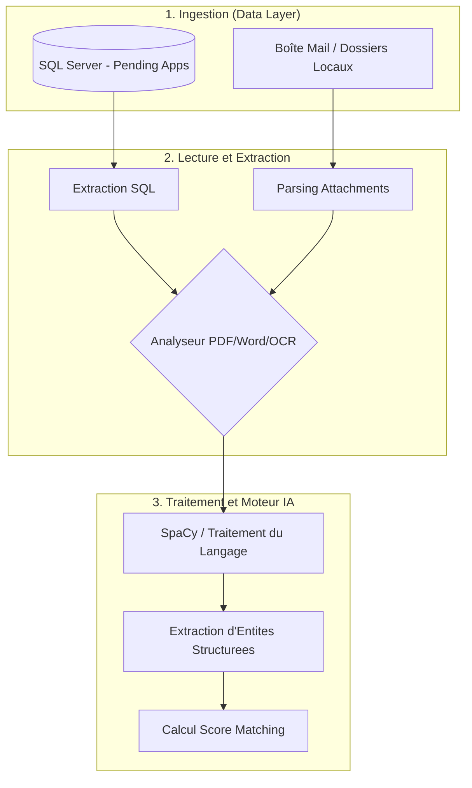

# 🧠 AI Recruitment Service - Core Engine

<div align="center">
  
  
  
  
  
  
</div>

<br/>

Ce microservice Python constitue le cœur intelligent (**Core AI System**) de notre application de recrutement. Il fonctionne **en parfaite autonomie** pour scanner, ingérer, comprendre et évaluer les candidatures, qu'elles proviennent du portail web (Base de données) ou directement d'une boîte mail (IMAP/Dossiers locaux).

En appliquant la méthodologie **CRISP-DM** et les principes de **LLMOps**, le moteur détecte les compétences, expériences et diplômes via IA/NLP et génère automatiquement un profil candidat structuré synchronisé avec une base de données SQL Server.

---

## 🎯 Méthodologie CRISP-DM

Notre processus d'implémentation de la donnée a suivi rigoureusement le cycle de vie CRISP-DM :

1. **Business Understanding (Compréhension Métier)** : Automatiser le traitement des candidatures et le matching (scoring) avec les offres d'emploi (Job Sessions) afin de réduire la charge mentale et temporelle des recruteurs.
2. **Data Understanding (Compréhension des Données)** : Analyse de données hétérogènes (CV en PDF/Word, corps d'e-mails, attributs SQL structurés).
3. **Data Preparation (Préparation des Données)** : Nettoyage du texte (`cleaner.py`), extraction OCR (`easyocr`, `pytesseract`), parsing de documents (`pdfplumber`, `python-docx`).
4. **Modeling (Modélisation)** : Extraction d'entités avec SpaCy et calcul d'affinité dynamique à l'aide de l'intégration de grands modèles de langage et d'analyseurs sémantiques.
5. **Evaluation (Évaluation)** : Système de scoring (0-100) avec explication justifiant la note du candidat.
6. **Deployment (Déploiement)** : API FastAPI avec un orchestrateur autonome (Background Cron Job) s'exécutant toutes les 4 heures.

---

## 🤖 Principes de LLMOps Intégrés

1. **Pipeline Robuste (Data Engineering)** : Préparation des données brutes en amont pour éviter les hallucinations du modèle et optimiser la fenêtre de contexte.
2. **Parsing Structuré** : Contrainte du format de sortie en objets structurés (JSON strict) mappant directement à la table SQL Server.
3. **Automatisation Complète** : Exécution asynchrone sans intervention humaine, gestion des logs partagés (`logger.py`).
4. **Évolutivité (Scalabilité)** : Isolation du module de Scoring et d'Extraction permettant de switcher facilement de modèles.

---

## 🏗 Architecture et Workflow (Le Pipeline Autonome)

- ⏱ **Cycle Cron Job** : Le système s'éveille automatiquement toutes les 4 heures en tâche de fond.
- 📨 **Ingestion Double (DB & IMAP)** : Il traite simultanément :
  - **E-mails non lus** (Boîte Mail) : Téléchargement dynamique ou parcs de dossiers (`emails/5551/`, etc.).
  - **Candidatures Web** (SQL Server) : Candidatures au statut `Pending`.
- 🧠 **Moteur NLP & IA** :
  - Routing des fichiers joints selon le format (PDF, DOCX, Image).
  - Nettoyage textuel par module `processing/`.
  - Entités (Skills, Experiences) isolées via SpaCy et LLM.
- 💾 **Insertion / Mise à jour Intelligente** :
  - Calcul du score d'adéquation (`ApplicationPreselectionScore`).
  - Sauvegarde structurée de l'évaluation et des entités en DB et mise au statut `Done`.



---

## 🛠️ Commandes Utiles & Installation

### 1. Installation de l'Environnement

```powershell
# 1. Créer l'environnement virtuel
python -m venv .venv

# 2. Activer l'environnement (Windows PowerShell)
.\.venv\Scripts\Activate.ps1

# 3. Installer les dépendances
pip install -r requirements.txt

# 4. Télécharger le modèle de langue (SpaCy)
python -m spacy download fr_core_news_sm
```

### 2. Lancement du Serveur

Lancez l'API et le Background Cron Job avec uvicorn :

```powershell
python -m uvicorn ai_service.main:app --reload
```
L'interface de documentation interactive Swagger UI sera disponible sur `http://localhost:8000/docs`.

### 3. Exécution des Tests Diagnostiques

Vous pouvez tester certaines briques du moteur directement sans lancer le serveur complet.

**Lancer le test de l'ingestion et du pipeline dans la console :**
```powershell
python test_pipeline.py
```

**Lancer les tests de base (Smoke Tests) :**
```powershell
python -m pytest tests/test_smoke.py
```
*(Si `pytest` n'est pas installé, vous pouvez l'ajouter via `pip install pytest`)*

---

## � CI/CD Pipeline (Intégration et Déploiement Continus)

Un pipeline **GitHub Actions** (`.github/workflows/ci.yml`) est configuré pour garantir la robustesse du projet :
- **Déclencheurs** : S'exécute automatiquement lors de `push` et `pull_request` sur les branches `main`/`master`.
- **Environnement** : Serveurs Ubuntu.
- **Étapes du Workflow** :
  1. Clonage du code (`actions/checkout`).
  2. Initialisation de l'environnement Python 3.11 avec cache pour `pip`.
  3. Installation des dépendances via `requirements.txt`.
  4. Exécution automatisée des **Tests Unitaires** (`pytest tests/`) couvrant les modules NLP (`cleaner.py`), les modèles de données Pydantic (`models.py`) et la validation de l'extraction (`text_extractor.py`).

---

## �🔮 Évolution (Roadmap)
- Intégration accrue de modèles ouverts (Mistral/Llama) pour réduire les coûts d'API.
- Suivi et Monitoring via des outils d'observabilité spécialisés pour IA de type LangSmith.
- Augmentation de la complexité des cas de tests automatisés (Unit & Integration Testing).
